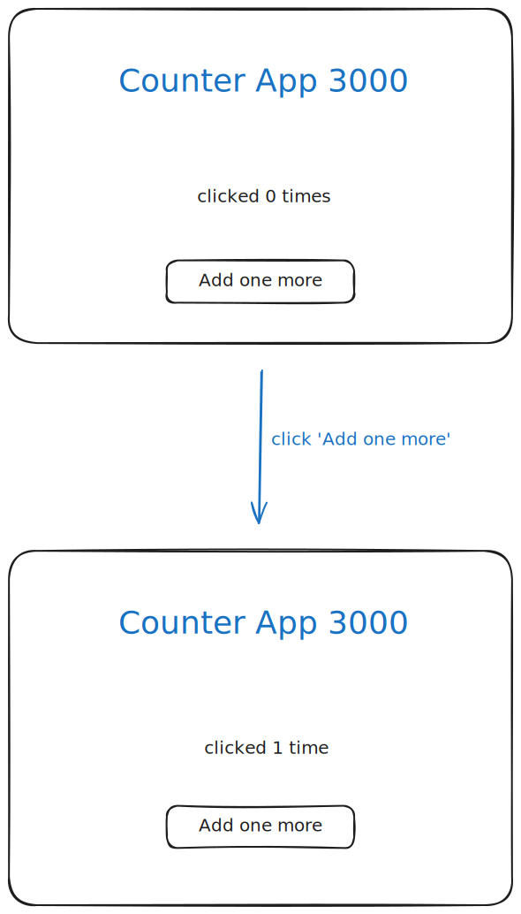

# Project: Build a Counter App with HTML and JavaScript

In this project, you'll create a simple counter app using HTML and JavaScript.

This project is designed to be completed _within two and a half hours_.

For every step:

- Read the brief and acceptance criteria (and hints if you want). If you're
  unsure what to do, get help immediately.
- When you've fulfilled the acceptance criteria, make a commit and push it to
  GitHub. This means **one commit per step**.
- In the associated GitHub project board, move your card.

Here's a sketch of what you'll build:

---

## Step 1: Fork the Starter Repository

**Brief:**

Fork the provided GitHub repository to your own account to begin the project.
Change the `README.md` in your fork, remove all the instructions, and instead
just give it a headline with the name for your counter app. A headline in
Markdown starts with a hashtag and a space `# `, so for example
`# Robert's Counter App 3000`.

**Acceptance Criteria:**

- ✅ The repository is forked to your GitHub account.
- ✅ You have cloned the forked repository to your local machine.
- ✅ You have replaced the `README.md` with your own README.

Don't forget to commit, push, and move your project card.

---

## Step 2: Set Up the Project Structure

**Brief:**

Create the basic file structure for your project.

**Acceptance Criteria:**

- ✅ Your repository contains `index.html`, `style.css`, `script.js` files.
- ✅ All files are correctly linked:
  - `script.js` is linked in `index.html` before the closing `</body>` tag
  - `style.css` is linked in `index.html` inside the `<head>` tag

---

## Step 3: Create the Basic HTML Structure

**Brief:**

Set up the foundational HTML structure in `index.html`.

**Acceptance Criteria:**

- ✅ `index.html` includes the `<!DOCTYPE html>` declaration.
- ✅ The `<html>`, `<head>`, and `<body>` tags are correctly set up.
- ✅ A `<title>` tag is added with your app title, e.g. "Rob's Counter App
  3000".

---

## Step 4: Design the Counter Interface

**Brief:**

Create the main interface elements: a headline, a counter, and a button. They
should all be centered on the page.

Have a look at the interface design linked above.

**Acceptance Criteria:**

- ✅ An element (e.g., `<h1>`) is added to display the headline.
- ✅ An element (e.g., `
`) is added to display counter.
- ✅ An "Add one more" button is added to increment the counter. This can be a
  `
` or a `<button>` tag.

---

## Step 5: Add an onClick handler to the button

**Brief:**

Use JavaScript to add an onClick handler to your "Add one more". To start with,
make the handler display an alert of some sort.

**Acceptance Criteria:**

- ✅ The button, when clicked, shows an alert.
- ✅ The button, when clicked again, shows an alert again.

  
Hints

  - Use `document.getElementById()` to get a reference to your button in
    JavaScript.
  - Use `addEventListener()` to add an onClick handler to your button.
  - Use `alert()` to display an alert to the user.

---

## Step 6: Change the onClick handler to change the counter text

**Brief:**

When the user clicks on "Add one more", the counter text should change from
"clicked 0 times" to "clicked 1 times", to "clicked 2 times", etc. Don't worry
about the grammar for now.

**Acceptance Criteria:**

- ✅ When the user clicks on "Add one more", the counter text should change to
  reflect how many times the user has clicked.

  
Hints

  - In your onClick handler, get a reference to the counter text using e.g.
    `let label = document.getElementById(...)`.
  - **Outside** your onClick handler, define a variable to hold the number of
    times the button has been clicked.
  - Use a template string literal (backticks) to compose the counter text using
    the variable holding the number of times the button has been clicked.

---

## Step 7: Fix the grammar

**Brief:**

The correct text after one click should be "clicked 1 time", not "1 times".

**Acceptance Criteria:**

- ✅ The grammatically correct text is shown after one click of the button.

  
Hints

  - `if ....`

---

## Step 8: Refactor and Comment Your Code

**Brief:**

Clean up your code for readability and maintainability.

**Acceptance Criteria:**

- ✅ JavaScript functions are properly named and scoped.
- ✅ Comments are added to explain complex code sections.
- ✅ Unused code and console logs are removed.

---

## Step 9: Deploy the App on Netlify

**Brief:**

Make your application accessible online via [surge.sh](https://surge.sh).

**Acceptance Criteria:**

- ✅ The app is live and accessible through a URL.
- ✅ A link to your deployed app is included in your `README.md`

**Congratulations!** You've built and deployed a functional counter application
using HTML and JavaScript.

---

# Grading

For every completed step you can get 1 point (9 total). You can get partial
points if your solution does not pass all the acceptance criteria.
